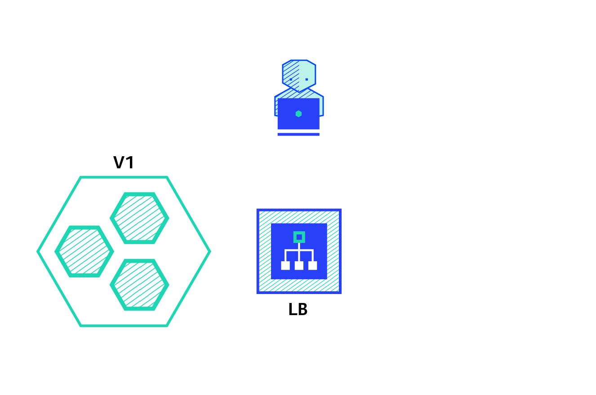

# Recreate

A deployment defined with a strategy of type Recreate will terminate all the running instances then recreate them with the newer version.



# Go to the right directory

```bash
cd ~/kubernetes-workshop/k8s/recreate/
````

# Create namespace

```bash
kubectl create ns recreate
````

# Deploy App v1

```bash
kubectl apply -n recreate -f app-v1.yaml
````

Test:

```bash
curl http://$IP_ADDRESS:30080/api
````

Or in browser:
<http://[PUBLIC IP_ADDRESS]:30080>

# Deploy App v2

```bash
kubectl apply -n recreate -f app-v2.yaml
````

Downtime is expected because v1 is killed before v2 is started and healthy:

```bash
curl http://$IP_ADDRESS:30080/api
````

Or in browser:
<http://[PUBLIC IP_ADDRESS]:30080>

# Clean up

```bash
kubectl delete ns recreate
````
